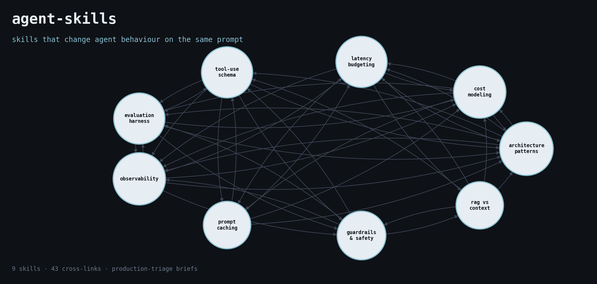

# Agent Skills



A curated collection of [Agent Skills](https://agentskills.io/home) — Markdown-based instructions that give AI coding agents (Claude Code, Gemini CLI, Cursor, Codex, etc.) durable domain expertise instead of one-shot prompting.

Opinionated, written from production triage of real agent failures. Each skill is a short, declarative brief: when to use it, the decision flow, the anti-patterns, the hard line that gates merge.

## What makes this different

Most "awesome agent" lists catalogue frameworks and papers. These skills change agent **behaviour** on the same prompt.

- **From production triage.** Every brief encodes a failure pattern seen — or shipped — at least three times.
- **Each skill has a hard line.** One sentence that gates merge, deploy, or approval. Not advice; a rule.
- **Anti-patterns are named, not hinted at.** The skill watches for them on every prompt that fires it.
- **Decision flows are numbered and top-down.** The agent walks the checklist before recommending anything.
- **Cross-linked.** Skills point at the next decision along the path (architecture → cost → latency → eval → observability → guardrails).

If you want a survey of frameworks, start with an awesome-list. If you want briefs that change what the agent says on the same prompt, start here.

## Proof, not just briefs

Each skill ships with a `TRANSCRIPT.md` — one realistic prompt, the agent's response without the skill loaded, the agent's response with it loaded, and the diff annotated. Read those before deciding which skills to install.

Five skills ship a reproducible 20-task eval under [`eval/`](./eval/):

- [`agent-architecture-patterns`](./eval/agent-architecture-patterns/)
- [`agent-cost-modeling`](./eval/agent-cost-modeling/)
- [`guardrails-and-safety`](./eval/guardrails-and-safety/)
- [`prompt-caching`](./eval/prompt-caching/)
- [`tool-use-schema-design`](./eval/tool-use-schema-design/)

Each has methodology, prompts, rubric, anchored examples, runner, scorer, and a results template you can run against your own agent.

Browse [`FAILURES.md`](./FAILURES.md) for the failure-pattern → skill index — the production failures each skill exists to catch.

## Installation

The `SKILL.md` format is **Claude Code-native** (matches the published Agent Skills format). For other agents, the **content is portable** — only the loading mechanism differs.

| Agent | Native skill support | How to install |
|-------|----------------------|----------------|
| Claude Code | Yes (Agent Skills) | Symlink into `~/.claude/skills/` |
| Gemini CLI | No — load as context | `@`-reference each `SKILL.md` from `GEMINI.md` |
| Cursor | No — convert to Rule | Copy `SKILL.md` into `.cursor/rules/<name>.mdc`, add `alwaysApply: false` |
| Codex | No — load via system prompt | Include `SKILL.md` content under a heading in `AGENTS.md` |

### Claude Code (native)

```bash
git clone https://github.com/cobusgreyling/agent-skills.git
cd agent-skills

mkdir -p ~/.claude/skills
for s in skills/*/; do
  ln -sf "$PWD/$s" ~/.claude/skills/
done
```

Restart Claude Code. Skills appear in the available-skills list and fire on matching prompts.

Selective install: symlink only the skills you want — `ln -sf "$PWD/skills/agent-architecture-patterns" ~/.claude/skills/`.

Installer alternative (third-party, may not cover every agent — fall back to the manual path if it fails):

```bash
npx skills add cobusgreyling/agent-skills
```

### Gemini CLI

Reference the skill content from your project's `GEMINI.md`:

```markdown
# Project context

@./agent-skills/skills/agent-architecture-patterns/SKILL.md
@./agent-skills/skills/tool-use-schema-design/SKILL.md
```

Gemini loads the referenced files into context. Treat the SKILL.md as a directive, not a document — the body is written as instructions for the agent.

### Cursor

Cursor uses MDC Rules, not Agent Skills. Convert per-skill:

```bash
mkdir -p .cursor/rules
cp skills/agent-architecture-patterns/SKILL.md \
   .cursor/rules/agent-architecture-patterns.mdc
```

Then edit the frontmatter to match Cursor's Rule format:

```yaml
---
description: <copy from SKILL.md description>
globs: ["**/*"]
alwaysApply: false
---
```

The body works as-is.

### Codex

Codex reads `AGENTS.md` at project root. Either include the skill content under a heading, or `@`-include the file if your Codex version supports it:

```markdown
# Agent rules

## Tool-use schema design

<paste body of skills/tool-use-schema-design/SKILL.md>
```

### Auto-generated variants

Run the converter to regenerate the Cursor / Codex / Gemini variants from the canonical `SKILL.md` files — keeps them from drifting:

```bash
python scripts/convert.py --target all
# writes out/cursor/.cursor/rules/*.mdc, out/codex/AGENTS.md, out/gemini-cli/GEMINI.md
```

## Available Skills

<!-- BEGIN: auto-generated skill index -->
- [**agent-architecture-patterns**](./skills/agent-architecture-patterns) — Choose the right architecture for an LLM agent or multi-agent system. Use when the user is designing, comparing, or debugging agentic workflows and mentions ReAct, Reflexion, Plan-and-Execute, Router, Supervisor, Hierarchical, multi-agent, tool-use loop, agent graph, LangGraph, AutoGen, CrewAI, or asks "which agent pattern should I use" / "how should this agent be structured".  
  _tags:_ `architecture`, `patterns`, `multi-agent`, `design`
- [**agent-cost-modeling**](./skills/agent-cost-modeling) — Model the cost of an LLM agent before it ships, and after. Use when the user is planning a deployment, comparing patterns, choosing a model tier, or justifying a budget and mentions tokens per task, cost per task, unit economics, cost ceiling, cache hit rate, ReAct cost, multi-agent cost, or asks "how much will this cost?" / "is this economical at scale?".  
  _tags:_ `cost`, `production`, `architecture`, `economics`
- [**agent-evaluation-harness**](./skills/agent-evaluation-harness) — Design an evaluation harness for an LLM agent before shipping it. Use when the user is building or rewriting an agent, deciding ship/no-ship, debugging regressions, or mentions golden sets, eval suites, regression tests, trace-level evals, LLM-as-judge, scoring rubrics, or asks "how do I test this agent?" / "how do I know if my agent got better?".  
  _tags:_ `evaluation`, `production`, `regression`, `quality`
- [**agent-observability**](./skills/agent-observability) — Instrument an LLM agent so failures are diagnosable, traces are replayable, and evals can run against production data. Use when the user is moving an agent past prototype and mentions tracing, spans, OpenTelemetry, LangSmith, Langfuse, Arize, OpenLLMetry, structured logs, GenAI semantic conventions, or asks "how do I debug this agent in production?" / "what should I log?".  
  _tags:_ `observability`, `tracing`, `production`, `opentelemetry`
- [**context-window-hygiene**](./skills/context-window-hygiene) — Manage what enters and stays in the context window — pruning, compaction, summary fidelity, ordering — so the agent stays coherent on long runs without inflating cost. Use when the user is hitting context limits, running long agentic loops, paying for full-history replays, or asks "how do I keep context manageable?" / "the agent forgets things after N turns".  
  _tags:_ `context-engineering`, `cost`, `latency`, `architecture`
- [**guardrails-and-safety**](./skills/guardrails-and-safety) — Design guardrails for an LLM agent that handles user input, calls real tools, or operates in a regulated domain. Use when the user is building a user-facing agent and mentions guardrails, jailbreaks, prompt injection, content moderation, PII redaction, output validation, red-teaming, safety filters, or asks "how do I keep this agent from doing X?" / "how do I make this production-safe?".  
  _tags:_ `safety`, `guardrails`, `red-teaming`, `production`
- [**human-in-the-loop**](./skills/human-in-the-loop) — Design where, when, and how a human gates, reviews, or rescues an LLM agent — without turning the agent into a button labelled "approve". Use when the user is building an agent that takes irreversible actions or operates in regulated workflows and mentions human-in-the-loop, HITL, approval gate, escalation, review queue, oversight, or asks "when should a human approve this?" / "how do I add review without killing the agent's speed?".  
  _tags:_ `safety`, `oversight`, `production`, `workflow`
- [**latency-budgeting**](./skills/latency-budgeting) — Budget and engineer latency for an LLM agent — TTFT, tokens-per-second, tool round-trips, parallelism, streaming. Use when the user is building a user-facing or real-time agent and mentions latency, p50, p95, p99, TTFT, streaming, throughput, time-to-first-token, slow agent, or asks "why is my agent slow?" / "how do I hit a 2-second latency target?".  
  _tags:_ `latency`, `production`, `performance`, `user-experience`
- [**llm-as-judge**](./skills/llm-as-judge) — Design and validate LLM-as-judge scoring — pairwise vs pointwise, bias correction, anchor calibration, and the cases where a judge is the wrong tool. Use when the user is building an eval, scoring open-ended outputs, or comparing model versions and mentions LLM-as-judge, model grader, pairwise comparison, position bias, length bias, judge calibration, meta-eval, or asks "how do I score open-ended responses?" / "is my LLM-judge biased?".  
  _tags:_ `evaluation`, `scoring`, `quality`, `production`
- [**memory-design**](./skills/memory-design) — Design memory for an LLM agent — what to keep, where to keep it, and when memory hurts more than it helps. Use when the user is adding memory to an agent and mentions short-term memory, long-term memory, episodic, semantic, conversation history, summary memory, vector memory, memory store, mem0, Letta, MemGPT, or asks "should this agent remember?" / "why is the agent recalling the wrong thing?".  
  _tags:_ `memory`, `architecture`, `context-engineering`, `production`
- [**model-routing**](./skills/model-routing) — Pick the right model per call, not per project — route Opus/Sonnet/Haiku, GPT-5/4o/mini, Gemini Pro/Flash by task, and cut cost without losing quality. Use when the user is choosing model tiers, building a router, or debating Opus-only vs mixed-tier deployments and mentions model selection, model router, cascade, fallback, cheap-first, draft-then-verify, or asks "which model should I use?" / "do I need Opus for this?".  
  _tags:_ `cost`, `latency`, `architecture`, `model-selection`
- [**multi-agent-orchestration**](./skills/multi-agent-orchestration) — Decide when to split work across multiple agents vs one agent with tools, and design the handoffs when you do. Use when the user is sketching a multi-agent system or debugging one, and mentions handoff, delegation, supervisor, swarm, crew, sub-agent, agent-to-agent, A2A, manager-worker, team of agents, or asks "should I split this into multiple agents?" / "why do my agents talk forever and never finish?".  
  _tags:_ `multi-agent`, `orchestration`, `architecture`, `handoff`
- [**prompt-caching**](./skills/prompt-caching) — Use prompt caching correctly across Anthropic, OpenAI, Bedrock, and Gemini to cut cost and latency on hot paths. Use when the user is building a production LLM app and mentions prompt caching, cache hits, cache key, cache TTL, ephemeral cache, system-prompt caching, or asks "why is my cache hit rate low?" / "should I cache this?".  
  _tags:_ `caching`, `cost`, `latency`, `production`, `claude`
- [**prompt-injection-defense**](./skills/prompt-injection-defense) — Defend an LLM agent against prompt injection — direct, indirect, tool-result, and document-borne. Use when the user is building an agent that reads untrusted content (web pages, emails, documents, tool outputs) or exposes user-provided text to a downstream agent, and mentions prompt injection, indirect injection, jailbreak via document, tool-result injection, untrusted input, instruction override, or asks "how do I stop the agent from following injected instructions?" / "is RAG safe from injection?".  
  _tags:_ `security`, `injection`, `safety`, `production`
- [**rag-vs-context-engineering**](./skills/rag-vs-context-engineering) — Decide between RAG, long-context, structured tool retrieval, and prompt-only approaches for grounding an LLM in private or fresh data. Use when the user is designing a knowledge-grounded agent or chatbot and mentions RAG, vector search, embeddings, retrieval, chunking, long context, context window, tool retrieval, hybrid search, rerank, or asks "do I need RAG?" / "should I just use a big context window?".  
  _tags:_ `rag`, `retrieval`, `context-engineering`, `architecture`
- [**structured-output-reliability**](./skills/structured-output-reliability) — Get reliable structured output (JSON, typed objects) out of an LLM without regex repair, retry loops, or silent corruption. Use when the user is parsing model output, fighting malformed JSON, comparing JSON mode vs function calling vs structured outputs, or asks "why does the model keep breaking my schema?" / "how do I force valid JSON?".  
  _tags:_ `structured-output`, `reliability`, `tool-use`, `production`
- [**tool-failure-handling**](./skills/tool-failure-handling) — Design retry, idempotency, timeout, and recovery behaviour for an agent's tool calls — not the schema (that's a separate skill), but the runtime semantics. Use when the user is building or debugging an agent's tool loop and mentions retries, idempotency keys, timeouts, exponential backoff, compensation, partial failure, tool unavailable, 429, 503, flaky tool, or asks "how should the agent retry?" / "the tool failed mid-call, now what?".  
  _tags:_ `tool-use`, `reliability`, `production`, `error-handling`
- [**tool-use-schema-design**](./skills/tool-use-schema-design) — Design tool schemas (function-calling definitions) that LLMs can use reliably. Use when the user is defining tools for Claude, GPT, Gemini, or any function-calling agent and mentions tool definitions, function calling, JSON schema, tool descriptions, parameters, structured outputs, MCP tools, or asks "why is the model calling my tool wrong?" / "how should I design this tool?".  
  _tags:_ `tool-use`, `function-calling`, `mcp`, `architecture`
<!-- END: auto-generated skill index -->

> Regenerated by `python scripts/build_index.py`. CI fails if this section drifts.

## Skills by tag

<!-- BEGIN: auto-generated tag matrix -->
| Tag | Skills |
| --- | --- |
| `architecture` | [agent-architecture-patterns](./skills/agent-architecture-patterns), [agent-cost-modeling](./skills/agent-cost-modeling), [context-window-hygiene](./skills/context-window-hygiene), [memory-design](./skills/memory-design), [model-routing](./skills/model-routing), [multi-agent-orchestration](./skills/multi-agent-orchestration), [rag-vs-context-engineering](./skills/rag-vs-context-engineering), [tool-use-schema-design](./skills/tool-use-schema-design) |
| `caching` | [prompt-caching](./skills/prompt-caching) |
| `claude` | [prompt-caching](./skills/prompt-caching) |
| `context-engineering` | [context-window-hygiene](./skills/context-window-hygiene), [memory-design](./skills/memory-design), [rag-vs-context-engineering](./skills/rag-vs-context-engineering) |
| `cost` | [agent-cost-modeling](./skills/agent-cost-modeling), [context-window-hygiene](./skills/context-window-hygiene), [model-routing](./skills/model-routing), [prompt-caching](./skills/prompt-caching) |
| `design` | [agent-architecture-patterns](./skills/agent-architecture-patterns) |
| `economics` | [agent-cost-modeling](./skills/agent-cost-modeling) |
| `error-handling` | [tool-failure-handling](./skills/tool-failure-handling) |
| `evaluation` | [agent-evaluation-harness](./skills/agent-evaluation-harness), [llm-as-judge](./skills/llm-as-judge) |
| `function-calling` | [tool-use-schema-design](./skills/tool-use-schema-design) |
| `guardrails` | [guardrails-and-safety](./skills/guardrails-and-safety) |
| `handoff` | [multi-agent-orchestration](./skills/multi-agent-orchestration) |
| `injection` | [prompt-injection-defense](./skills/prompt-injection-defense) |
| `latency` | [context-window-hygiene](./skills/context-window-hygiene), [latency-budgeting](./skills/latency-budgeting), [model-routing](./skills/model-routing), [prompt-caching](./skills/prompt-caching) |
| `mcp` | [tool-use-schema-design](./skills/tool-use-schema-design) |
| `memory` | [memory-design](./skills/memory-design) |
| `model-selection` | [model-routing](./skills/model-routing) |
| `multi-agent` | [agent-architecture-patterns](./skills/agent-architecture-patterns), [multi-agent-orchestration](./skills/multi-agent-orchestration) |
| `observability` | [agent-observability](./skills/agent-observability) |
| `opentelemetry` | [agent-observability](./skills/agent-observability) |
| `orchestration` | [multi-agent-orchestration](./skills/multi-agent-orchestration) |
| `oversight` | [human-in-the-loop](./skills/human-in-the-loop) |
| `patterns` | [agent-architecture-patterns](./skills/agent-architecture-patterns) |
| `performance` | [latency-budgeting](./skills/latency-budgeting) |
| `production` | [agent-cost-modeling](./skills/agent-cost-modeling), [agent-evaluation-harness](./skills/agent-evaluation-harness), [agent-observability](./skills/agent-observability), [guardrails-and-safety](./skills/guardrails-and-safety), [human-in-the-loop](./skills/human-in-the-loop), [latency-budgeting](./skills/latency-budgeting), [llm-as-judge](./skills/llm-as-judge), [memory-design](./skills/memory-design), [prompt-caching](./skills/prompt-caching), [prompt-injection-defense](./skills/prompt-injection-defense), [structured-output-reliability](./skills/structured-output-reliability), [tool-failure-handling](./skills/tool-failure-handling) |
| `quality` | [agent-evaluation-harness](./skills/agent-evaluation-harness), [llm-as-judge](./skills/llm-as-judge) |
| `rag` | [rag-vs-context-engineering](./skills/rag-vs-context-engineering) |
| `red-teaming` | [guardrails-and-safety](./skills/guardrails-and-safety) |
| `regression` | [agent-evaluation-harness](./skills/agent-evaluation-harness) |
| `reliability` | [structured-output-reliability](./skills/structured-output-reliability), [tool-failure-handling](./skills/tool-failure-handling) |
| `retrieval` | [rag-vs-context-engineering](./skills/rag-vs-context-engineering) |
| `safety` | [guardrails-and-safety](./skills/guardrails-and-safety), [human-in-the-loop](./skills/human-in-the-loop), [prompt-injection-defense](./skills/prompt-injection-defense) |
| `scoring` | [llm-as-judge](./skills/llm-as-judge) |
| `security` | [prompt-injection-defense](./skills/prompt-injection-defense) |
| `structured-output` | [structured-output-reliability](./skills/structured-output-reliability) |
| `tool-use` | [structured-output-reliability](./skills/structured-output-reliability), [tool-failure-handling](./skills/tool-failure-handling), [tool-use-schema-design](./skills/tool-use-schema-design) |
| `tracing` | [agent-observability](./skills/agent-observability) |
| `user-experience` | [latency-budgeting](./skills/latency-budgeting) |
| `workflow` | [human-in-the-loop](./skills/human-in-the-loop) |
<!-- END: auto-generated tag matrix -->

## Contributing a skill

1. Create `skills/<your-skill>/SKILL.md` with the frontmatter shown below.
2. Write a `description:` that names the **products, verbs, and keywords** that should fire the skill. Vague descriptions don't trigger.
3. Add `tags:` — kebab-case, max 8, drawn from the existing tag matrix where possible.
4. Add an `EXAMPLES.md` with 2–3 prompt/expected-behaviour pairs that demonstrate the skill firing correctly.
5. Add a `TRANSCRIPT.md` with the without-skill / with-skill side-by-side.
6. Put long material (CLI tables, deep-dives) under `references/` so the agent loads it on demand.
7. Run `python scripts/lint_skills.py` and `python scripts/build_index.py` before opening a PR.

See [AUTHORING.md](./AUTHORING.md) for the house style (hard line, anti-patterns, decision flow, eight conventions) and [CONTRIBUTING.md](./CONTRIBUTING.md) for the end-to-end PR walkthrough.

## Tooling

```
scripts/
  lint_skills.py            # validates frontmatter and body size for every SKILL.md
  build_index.py            # regenerates README index, tag matrix, skills.json
  convert.py                # writes per-agent variants (Cursor MDC, Codex AGENTS.md, Gemini @-refs)
  transcript_regression.py  # replays each TRANSCRIPT.md against current models; flags drift
```

## Layout

```
skills/
  <skill-name>/
    SKILL.md          # frontmatter + master prompt
    EXAMPLES.md       # 2–3 prompt/behaviour pairs
    references/       # optional sub-docs the agent loads on demand
```

Each `SKILL.md` begins with YAML frontmatter:

```yaml
---
name: skill-name
description: >-
  One- or two-sentence trigger description. The agent reads this to decide
  whether the skill is relevant. Be specific about WHEN to use it.
tags:
  - kebab-case
  - up-to-eight
---
```

The body is a normal Markdown prompt: prerequisites, commands, gotchas, examples. Each skill ends with a short **Why this exists** section linking to the original article or incident that motivated it.

## License

Apache 2.0 — see [LICENSE](./LICENSE).
